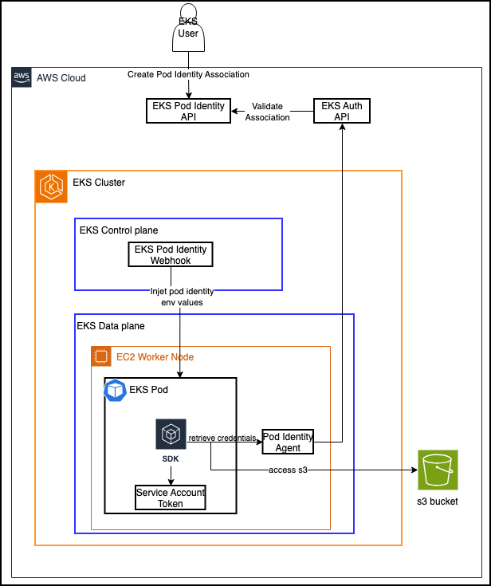

# AWS EKS Pod Identity Configuration

At a high level, EKS Pod Identity allows you to use the AWS API to define permissions that specific Kubernetes service accounts should have in AWS:

## Configuration
This configuration is for implementing AWS EKS Pod Identity, which involves creating the IAM Role and configuring the EKS PodIdentityAssociation.

```bash
apiVersion: pkg.crossplane.io/v1
kind: Configuration
metadata:
  name: configuration-aws-eks-pod-identity
spec:
  package: xpkg.upbound.io/upbound/configuration-aws-eks-pod-identity:v0.1.0
```

## The How

The following step is automatically completed when you install your EKS Cluster using our predefined configuration for AWS EKS - which is installed as dependency per default:

```bash
apiVersion: pkg.crossplane.io/v1
kind: Configuration
metadata:
  name: configuration-aws-eks
spec:
  package: xpkg.upbound.io/upbound/configuration-aws-eks:v0.12.0
```

Setting up Pod Identity starts by installing an add-on:
https://github.com/aws/eks-pod-identity-agent

```bash
aws eks create-addon \
  --cluster-name cluster-name \
  --addon-name eks-pod-identity-agent
```

This sets up a new DaemonSet in the kube-system namespace:

```bash
$ kubectl get daemonset -n kube-system
NAME                     DESIRED   CURRENT   READY   UP-TO-DATE   AVAILABLE   NODE SELECTOR   AGE
eks-pod-identity-agent   2         2         2       2            2           <none>
```


https://github.com/awslabs/crossplane-on-eks

### EKS Pod Identity at a glance

```bash
aws eks create-pod-identity-association \
  --cluster-name your-cluster \
  --namespace default \
  --service-account pod-service-account \
  --role-arn arn:aws:iam::012345678901:role/YourPodRole
```

Here, YourPodRole has the following trust policy:

```json
{
  "Version": "2012-10-17",
  "Statement": [{
    "Effect": "Allow",
    "Principal": {
      "Service": "pods.eks.amazonaws.com"
    },
    "Action": ["sts:AssumeRole","sts:TagSession"]
  }]
}
```

Once you’ve run the commands to configure Pod Identity, any pod that runs under the pod-service-account service account magically has access to AWS resources, through temporary Security Token Service (STS) credentials:

```bash

$ kubectl apply -f - <<EOF
apiVersion: v1
kind: Pod
metadata:
  name: pod-with-aws-access
spec:
  serviceAccountName: pod-service-account
  containers:
  - name: main
    image: public.ecr.aws/aws-cli/aws-cli
    command: ["sleep", "infinity"]
EOF

$ kubectl exec pod/pod-with-aws-access -- aws sts get-caller-identity
{
    "UserId": "XXXX",
    "Account": "012345678901",
    "Arn": "arn:aws:sts::012345678901:assumed-role/YourPodRole/eks-cluster-pod-xxx"
}

```

For a given EKS cluster, you can easily see which pods have access to AWS resources using eks:ListPodIdentityAssociations:

```bash
aws eks list-pod-identity-associations --cluster-name your-cluster

{
  "associations": [{
    {
            "clusterName": "your-cluster",
            "namespace": "default",
            "serviceAccount": "pod-service-account",
            "associationArn": "arn:aws:eks:us-east-1:012345678901:podidentityassociation/your-cluster/a-0123",
            "associationId": "a-0123"
        },

  }]
}
```

Then, you can use eks:DescribePodIdentityAssociation to retrieve the ARN of the role it maps to:

```bash
aws eks describe-pod-identity-association \
  --cluster-name your-cluster \
  --association-id a-0123

{
    "association": {
        "clusterName": "your-cluster",
        "namespace": "default",
        "serviceAccount": "pod-service-account",
        "roleArn": "arn:aws:iam::012345678901:role/YourRole"
    }
}
```
